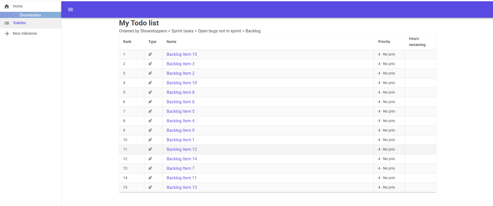
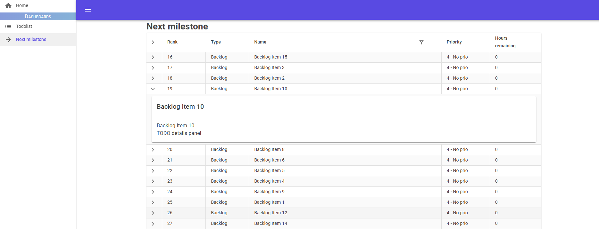

# PlanIt

Project planning view extensions for P4Plan

> This is a project we are hiring for, and will pay for resolution of
> issues. Please see [Contributing](CONTRIBUTING.md)

Web application that aims at providing better suited views to Helix Plan/P4 Plan database for users of the software working in the gaming industry.

Main scheduled features are:
- Custom todolist
- Common sprint view (assembling team sprints into project sprint)
- Dashboards with filtering and display
- Connexion with Swarm

Sceenshots on a dummy database:

